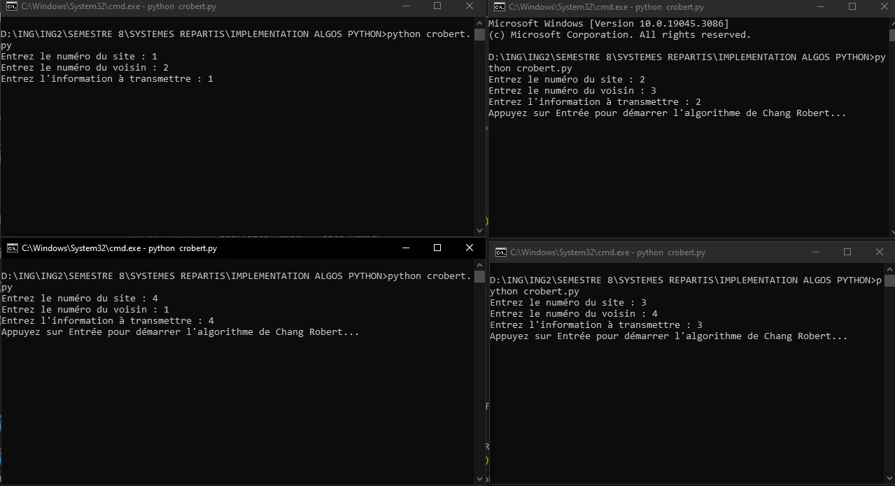

# Chang_Robert
Distributed Algorithm in python whit multiple process (Host)



### How we can run
- Launch 4 different terminals
- Run the same program in the different terminals and follow the successive steps

```
python main.py
```

### Licence
    Open source

### Teacher :
    Dr. LOKPO IBRAHIM

### Students
    - BINI Aladji Kassoum
    - KONAN Kouadio Aimé Junior Stéphane
    - MEDA Kechiedou Luis-Borges Dégrize *
    
    student engineer cumputerscientist 2nd year 